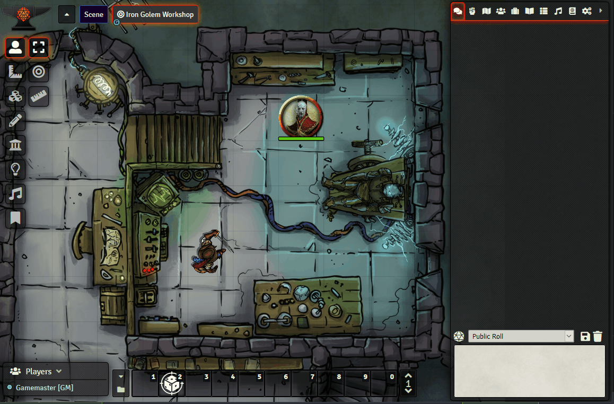
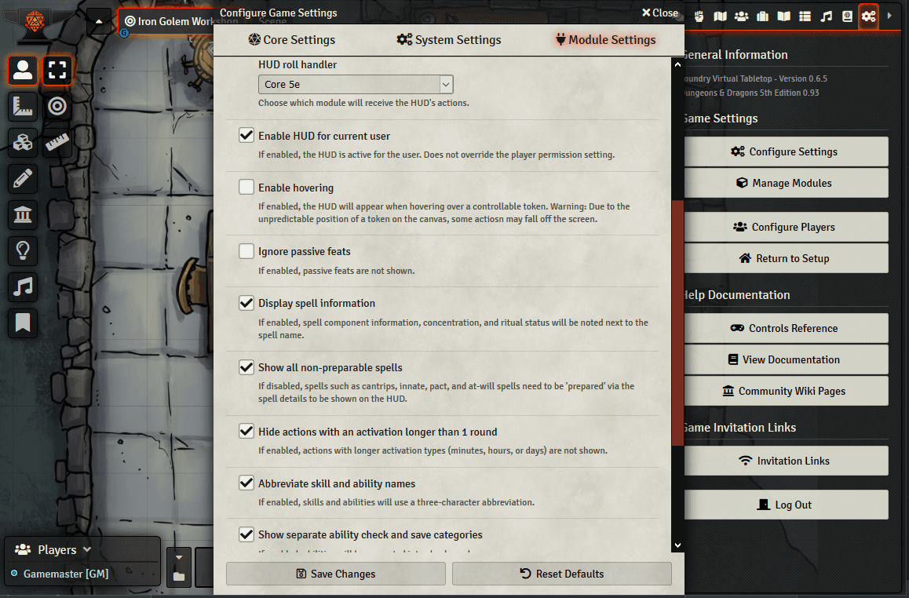
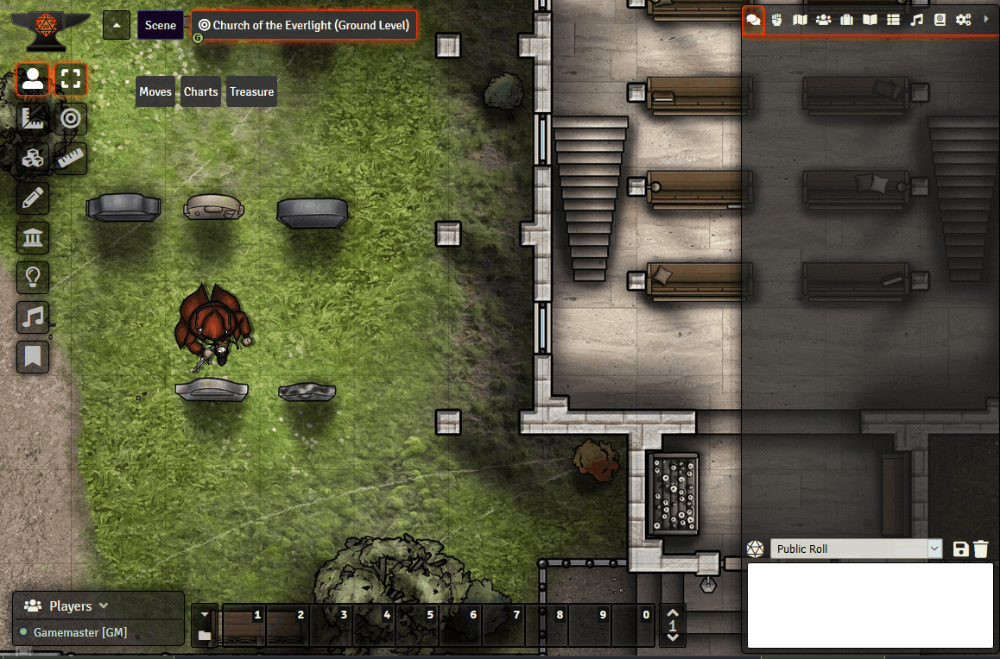
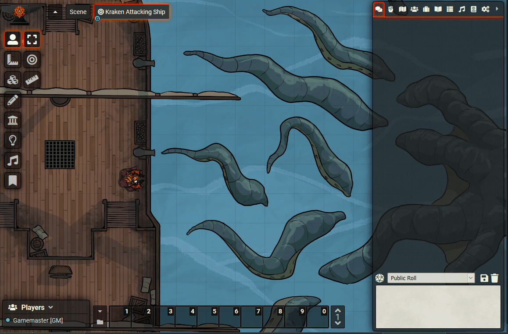

# Token Action HUD
This module populates a repositionable HUD showing the most common basic actions for a selected token. Currently the HUD supports DND5e, WFRP4e, Dungeon World, and Pathfinder 2E.

# Installation
1. Inside Foundry's Configuration and Setup screen, go to **Add-on Modules**
2. Click "Install Module"
3. In the Manifest URL field paste: `https://github.com/espositos/fvtt-tokenactionhud/raw/master/module.json`
4. Within the game, click on **Settings** -> **Manage Modules** and make sure the Token Action Hud is enabled.

# Usage
Once activated, selecting a token that has an actor/character sheet associated with it and that you have permission to control should display an an action bar that is populated with the actions and abilities available for that token. The HUD can be disabled on a per-user basis if so desired.

Offers a variety of settings including support for third-party roll handlers (Please contact me if you'd like to add yours, or improve the functionality of those offered), and can be repositioned.

## Support for WFRP

## Dungeon World

## Pathfinder 2E

# Supported systems
* DND5e (including BetterRolls and MinorQol)
* Dungeon World
* PF2E
* WFRP4e
* Any other system? I believe the HUD is modular enough that anyone who understands what the players of their system want and how actions in their system are handled could quickly build it into the HUD. Please contact me if you'd like to add support for your favourite system.

[Developing for your system or module](adding_systems.md)

# Support
For questions, feature requests, or bug reports, feel free to contact me on the Foundry Discord (^ and stick#0520) or open an issue here directly.
* Feel free to submit pull requests with a justification of your change, or ask me before starting.
* The HUD's layout could do with some love. If you think you can improve things and know how your way around CSS, please get in touch!

# Thanks
Enormous thanks goes to the following people for their help in getting the HUD to its current state:
Kekilla#7036, Skimble#8601, Forien#2130, and the Fabricator General.
I'd also like to acknowledge the other module develops I've taken ideas and code from, as well as the other developers who make FoundryVTT a joy to use.

# License
This Foundry VTT module is licensed under a [Creative Commons Attribution 4.0 International License](https://creativecommons.org/licenses/by/4.0/).
This work is licensed under [Foundry Virtual Tabletop EULA - Limited License Agreement for module development](https://foundryvtt.com/article/license/).

